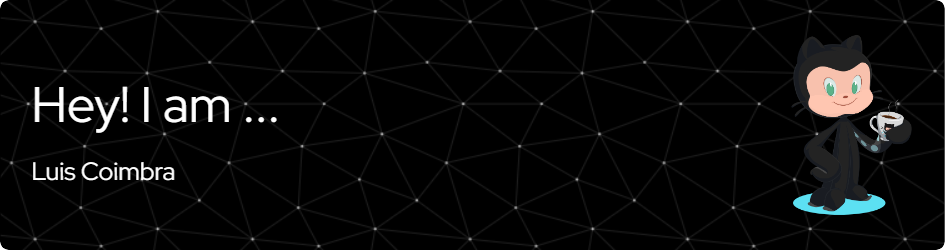

<!--
**luisggc/luisggc** is a ✨ _special_ ✨ repository because its `README.md` (this file) appears on your GitHub profile.

Here are some ideas to get you started:

- 🔭 I’m currently working on ...
- 🌱 I’m currently learning ...
- 👯 I’m looking to collaborate on ...
- 🤔 I’m looking for help with ...
- 💬 Ask me about ...
- 📫 How to reach me: ...
- 😄 Pronouns: ...
- ⚡ Fun fact: ...
-->

Data Analyst at Vale S.A. seeking career change to React Dev.

 

Passionate about how technology can impact lives, simplify routines and improve well being.
I have many works especially with Python, but now I intend to focus on React development. I have works with:

 
            

> "And let us not grow weary of doing good, for in due season we will reap, if we do not give up."

